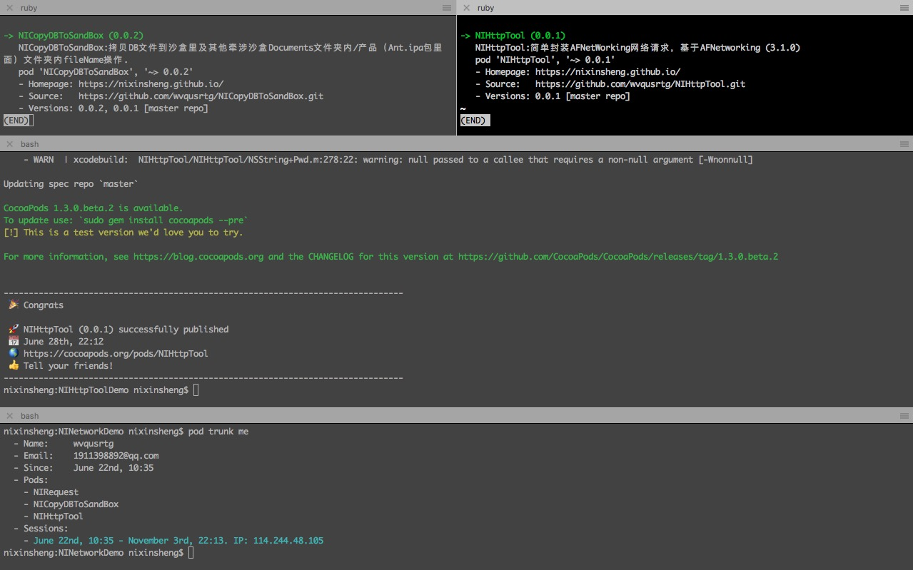
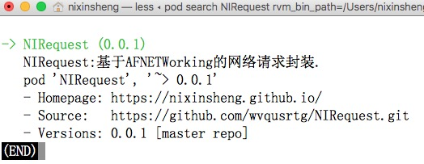

# NIHttpTool
NIHttpTool 简单封装AFNetWorking网络请求

---
>1、[地址:https://github.com/wvqusrtg/NIHttpTool](https://github.com/wvqusrtg/NIHttpTool.git)

>2、功能集合如下,不断更新中...
>/**
 *  ①总的请求，包含cache
 *
 *  @param cacheType   缓存的类型
 *  @param requestType  请求类型
 *  @param params 请求的参数
 *  @param success 请求成功后的回调
 *  @param failure 请求失败后的回调
 */
+ (void)requestHttpWithCacheType:(HttpCacheType)cacheType requestType:(HttpRequestType)requestType expired:(HttpCacheExpiredTimeType)expiredType url:(NSString *)url params:(NSDictionary *)params success:(successBlock)success failure:(void (^)(NSError *))failure;
>/**
 *  ②发送一个POST请求
 *
 *  @param url     请求路径
 *  @param params  请求参数
 *  @param success 请求成功后的回调
 *  @param failure 请求失败后的回调
 */
+ (void)postWithURL:(NSString *)url params:(NSDictionary *)params success:(void (^)(id json))success failure:(void (^)(NSError *error))failure;

/**
 *  ③发送一个POST请求(上传文件数据)
 *
 *  @param url     请求路径
 *  @param params  请求参数
 *  @paramformData  文件参数
 *  @param success 请求成功后的回调
 *  @param failure 请求失败后的回调
 */
+ (void)postWithURL:(NSString *)url params:(NSDictionary *)params formDataArray:(NSArray *)formDataArray success:(void (^)(id json))success failure:(void (^)(NSError *error))failure;

>/**
 *  ④发送一个GET请求
 *
 *  @param url     请求路径
 *  @param params  请求参数
 *  @param success 请求成功后的回调
 *  @param failure 请求失败后的回调
 */
+ (void)getWithURL:(NSString *)url params:(NSDictionary *)params success:(void (^)(id json))success failure:(void (^)(NSError *error))failure;

>/**
 * ⑤清除所有本地http缓存
 */
+ (void)clearAllLocalHttpCache:(clearHttpCacheBlock)block;

>/**
 * ⑥清除所有http时间缓存
 */
+ (void)clearAllLocalHttpTimeCache:(clearHttpExpiredCacheBlock)block;

>/**
 * ⑦清除所有http时间缓存
 */
+(NSString *)getCurrentDate;

>3、[一个老版本的传送门](https://github.com/wvqusrtg/NIRequest.git)

>

>4、问题、建议或你有更好的勿忘给个issues
    `QQ:1911398892`
    `微信:wvqusrtg`