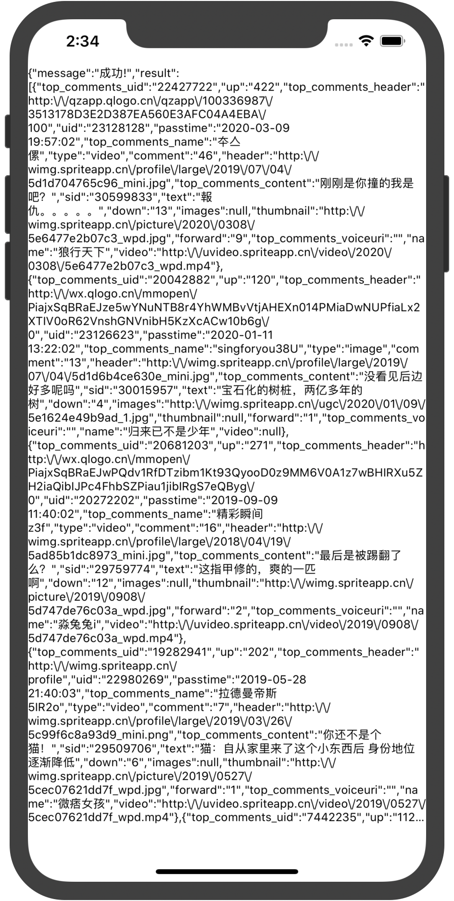

# NIHttpTool

[](https://travis-ci.org/1911398892@qq.com/NIHttpTool)
[](https://cocoapods.org/pods/NIHttpTool)
[](https://cocoapods.org/pods/NIHttpTool)
[](https://cocoapods.org/pods/NIHttpTool)

## Example

To run the example project, clone the repo, and run `pod install` from the Example directory first.

## 效果


## 目录结构
```
├── NIHttpTool
│   ├── Assets
│   └── Classes
│       ├── NIFileDataModel.h
│       ├── NIFileDataModel.m
│       ├── NIHttpStatus.h
│       ├── NIHttpStatus.m
│       ├── NIHttpTool.h
│       ├── NIHttpTool.m
│       ├── NSDictionary+Json.h
│       ├── NSDictionary+Json.m
│       ├── NSString+Pwd.h
│       └── NSString+Pwd.m
├── NIHttpTool.podspec
├── README.md
```

## 使用示例
 - 参见./Example/NIHttpTool/NIViewController.m
 ```
    //POST请求
    [NIHttpTool postWithURL:JUHE_URL params:self.dicPram success:^(id json) {
        NSLog(@"---success:%@",json);
        NSLog(@"---success「mj_JSONString」:%@",[json mj_JSONString]);
        self.label.text = [json mj_JSONString];
    } failure:^(NSError *error) {
        NSLog(@"---error:%@",error);
    }];
    //GET请求
    [NIHttpTool getWithURL:JUHE_URL_GET params:nil success:^(id json) {
        NSLog(@"---success:%@",json);
    } failure:^(NSError *error) {
         NSLog(@"---error:%@",error);
    }];
 ```

## Requirements
- iOS 8.0 or later

## Installation

NIHttpTool is available through [CocoaPods](https://cocoapods.org). To install
it, simply add the following line to your Podfile:

```
--------------------------------------------------------------------------------
 🎉  Congrats

 🚀  NIHttpTool (0.0.2) successfully published
 📅  August 7th, 00:48
 🌎  https://cocoapods.org/pods/NIHttpTool
 👍  Tell your friends!
--------------------------------------------------------------------------------
nixs@nixs-iMac NIHttpTool %
```

```ruby
pod 'NIHttpTool', "~> 0.0.2"
```

## Author

1911398892@qq.com, 1911398892@qq.com

## License

NIHttpTool is available under the MIT license. See the LICENSE file for more info.
